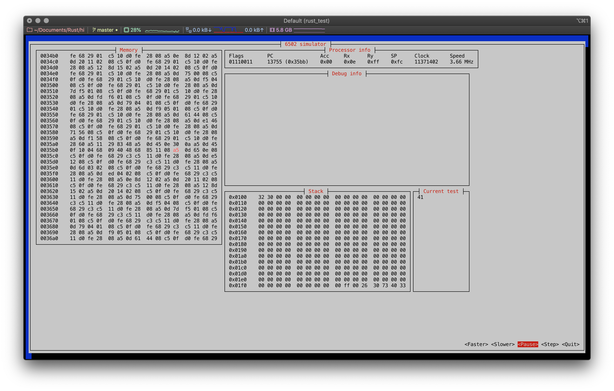

This is a small project to try Rust.

## 6502 Emulator to get a first taste of Rust

I wanted to try and build a 6502 emulator and I have heard that Rust has good performance with a focus on code safety, so I decided to give it a go.

This has been a fun project over the week-end, but now on Sunday night it's time to publish it.

If some experienced Rust developpers happen to glance at this, I'm waiting for your suggestions and critiques in the [Issues tab](https://github.com/jfoucher/rust-6502/issues)

The emulator is somewhat feature complete and uses the simplest form of emulation (a giant switch case with one branch per instruction). It can sucessfully pass the following test suite: [6502_functional_test.ca65](https://github.com/amb5l/6502_65C02_functional_tests). The emulated processor speed is about 3 to 3.5 MHz in release mode with no debug info and about 0.8 MHz in debug mode with debug info.

To run the code launch `cargo run 6502_functional_test.bin`

By the way you will need cc65 to compile the assembly code (a binary is included). The following is the line to run to assemble and build the test program :
`ca65 -l 6502_functional_test.lst 6502_functional_test.ca65 && ld65 6502_functional_test.o -o 6502_functional_test.bin   -m 6502_functional_test.map -C example.cfg`

You can view my hilarious struggle to get going in Rust by [viewing the history](https://github.com/jfoucher/rust-6502/commits/master) for this project

## Screenshot

